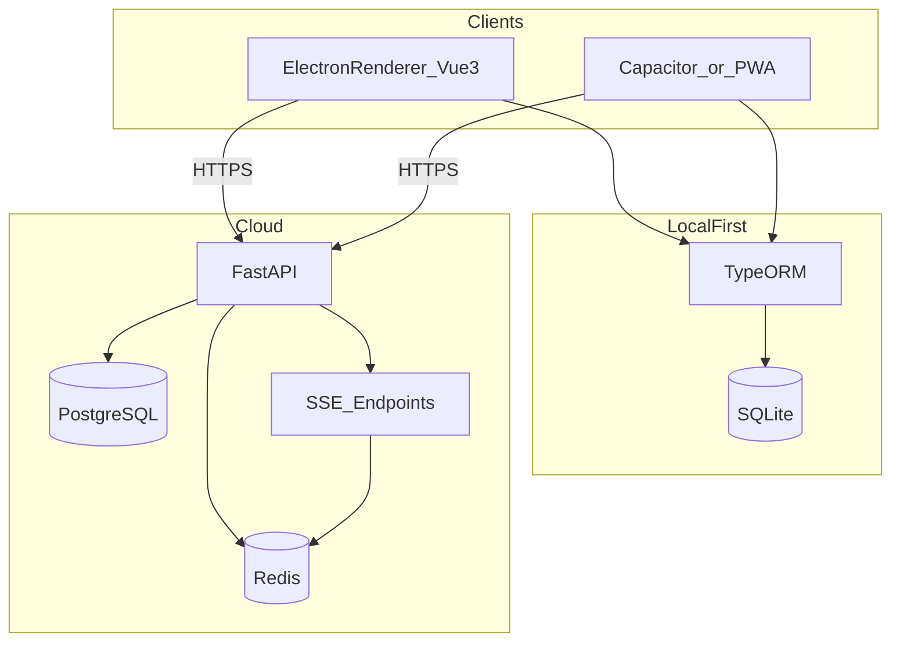

# 滴答清单类多端应用实现规划

## 目标与范围

- **对标能力（分阶段）**：任务/清单/项目、截止日期与提醒、重复规则、标签与筛选、子任务、附件（可选）、日历视图（可选）、全文搜索、离线可用、多端同步、协作（可后置）。
- **平台**：Windows / macOS / Linux 通过 **Electron** 覆盖；**移动端** 在你当前表中未指定壳方案，建议默认采用 **Capacitor + 同一套 Vue 代码**（最大化复用），或用 **PWA** 作为更轻的第一版移动端形态。

## 总体架构（建议 Monorepo）

使用 **pnpm workspace** 统一管理前端、Electron、后端与共享类型包。

**同步策略（核心设计）**：采用 **“本地数据库为权威 + 出站/入站同步队列”** 的本地优先模型；服务端保存用户维度的 **服务端版本号/更新时间** 与可选的 **设备同步游标**；冲突处理建议 MVP 用 **Last-Write-Wins（带服务端时间戳）** 或 **按字段合并（更复杂，后置）**。

**实时通道**：用 **Redis Pub/Sub（或 Streams）** 作为跨进程消息总线，FastAPI 通过 **sse-starlette** 向在线设备推送“某实体变更事件”；客户端收到事件后触发 **增量拉取/对账**（避免 SSE 直接传大 payload）。

## 仓库与工程结构（建议）

- `apps/web`：纯 Vue3 + Vite（可先在浏览器跑通 UI 与业务逻辑）
- `apps/desktop`：Electron 主进程 + 预加载脚本 + 复用 `apps/web` 构建产物
- `apps/mobile`：Capacitor 工程（复用 `apps/web`）或先做 PWA manifest
- `packages/shared`：DTO、枚举、错误码、同步协议版本号
- `services/api`：FastAPI 项目（异步 SQLAlchemy 2.x + Alembic 迁移）

## 阶段划分（可执行的里程碑）

### 阶段 0：工程基线与规范（1–2 周）

- 初始化 monorepo、TS 5、ESLint/Prettier（前端）、Black/Ruff（后端）、Conventional Commits、CI（lint + typecheck + 单测骨架）。
- 定义 **同步协议 v1**：实体类型（Task/Project/Tag/…）、字段 schema、删除策略（软删除 + `deleted_at`）、客户端 `clientMutationId` 幂等。
- 明确 **Electron 安全模型**：`contextIsolation`、禁用 `nodeIntegration` 在 renderer、通过 **preload + IPC** 暴露有限 API；本地密钥用 **OS keychain**（各平台封装）或加密落盘（后置）。

### 阶段 1：桌面端单机 MVP（3–6 周）

- Vue3 + Pinia + Naive UI：任务列表、详情、创建/编辑、基础筛选（今日/计划箱）、本地提醒（Electron 通知 + 定时器；精确唤醒可后置系统级方案）。
- SQLite + TypeORM：表结构、迁移策略（TypeORM migrations）、事务边界（批量写入）。
- **风险点提前验证**：Electron 打包后 **SQLite 原生驱动/编译** 与 TypeORM 组合常见踩坑；若构建/签名成本高，评估切换为 **better-sqlite3 + 轻量仓储层**（仍可用 TS 类型约束），但尊重你当前选型则优先把 **electron-rebuild**、平台矩阵 CI 跑通。

### 阶段 2：后端与账号体系（3–5 周）

- FastAPI：注册登录（建议 **JWT + Refresh** 或 **Session + HttpOnly Cookie** 二选一）、设备列表、密码重置流程（邮件可后置）。
- PostgreSQL：用户与核心实体表；Alembic 迁移；索引（按 `user_id + updated_at`）。
- Redis：会话/黑名单（若用 JWT）、SSE 连接元数据、热点缓存（可选）。
- Axios 封装：鉴权注入、401 刷新、重试与取消（与 Pinia 会话状态联动）。

### 阶段 3：同步引擎 v1（4–8 周，通常最长）

- 客户端：Outbox（待同步变更队列）+ Inbox（服务端增量）+ **对账拉取** API。
- 服务端：批量 upsert、幂等键、版本推进、删除传播。
- 可观测性：同步失败原因结构化日志（客户端上报可选）。
- 测试重点：**离线编辑 → 联网合并**、**多设备交错编辑**、**大批量导入**。

### 阶段 4：SSE 实时刷新（1–3 周）

- `sse-starlette`：按用户/设备订阅频道；心跳与断线重连策略（客户端指数退避）。
- 事件只传“变更提示”，数据仍以 SQLite/服务端查询为准，避免 SSE 与业务状态双写不一致。

### 阶段 5：移动端交付（3–6 周，取决于壳方案）

- **Capacitor 路线**：把 `apps/web` 产物嵌入 WebView；处理安全区域、手势返回、后台限制（提醒走系统推送需额外服务，后置）。
- **PWA 路线**：更快上线安装与离线（Service Worker 缓存静态资源；业务离线仍以 SQLite 为主在 Capacitor/Electron 更一致，PWA 的本地 DB 能力需单独评估）。

### 阶段 6：打磨与发布（持续）

- Electron：**自动更新**、代码签名（macOS/Windows）、崩溃上报。
- 国际化、无障碍、性能（列表虚拟滚动）、全文搜索（SQLite FTS5 或服务端搜索）。
- 数据导出/备份、隐私合规与密钥轮换策略。

## 关键 API 草案（便于前后端对齐）

- `POST /auth/login`、`POST /auth/refresh`
- `POST /sync/push`（批量变更，幂等）
- `GET /sync/pull?since=...`（增量）
- `GET /events/stream`（SSE）

## 非功能需求（建议写进里程碑验收）

- **一致性**：同步后本地与服务端可对账校验（开发期工具页）。
- **安全**：HTTPS、最小权限 IPC、敏感字段加密（可选）、服务端审计日志。
- **性能**：列表 1w 条仍可用（虚拟滚动 + 分页/游标）。
- **兼容性**：同步协议 **版本化**，允许老客户端逐步淘汰。

## 你需要提前拍板的 1 个产品/技术点

移动端优先 **Capacitor（复用 Vue）** 还是 **PWA（更快但能力受限）**，会影响阶段 5 工期与提醒能力；若不确定，建议默认 **Capacitor**。
